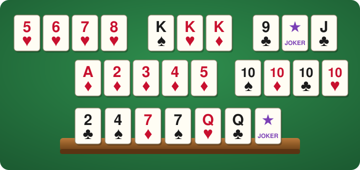

# PHP Rummy library

[](https://packagist.org/packages/garak/rummy)
[](https://packagist.org/packages/garak/rummy)



## Introduction

This library offers PHP classes for building a manipulation rummy game: two decks, a shared table that any player can rearrange, no discard pile. It is built on top of [garak/card](https://github.com/garak/card):

* `Game` — one round: players, hands, stock, table, turns and scores
* `Player` _(abstract, needs to be extended)_
* `Rules` — game parameters (decks, jokers, hand size, opening points, joker penalty)
* `Hand` — the cards held by a player
* `Meld`, `Set`, `Run` — valid combinations laid on the table
* `Table` — the melds currently on the table

### Rules

* Two decks plus two jokers. Ace counts as 1, king as 13. No wrap-around.
* Each player gets 14 cards. The rest is the face-down stock. There is no discard pile.
* A **set** is 3 or 4 cards of the same rank, all of different suits.
  A **run** is 3 to 13 consecutive cards of the same suit.
  Jokers are wild and worth the card they stand for.
* On their turn a player either **plays**, **draws** one card from the stock, or **passes** (only when the stock is empty).
* A play is the new layout of the whole table. It must add at least one card from the hand, and may
  rearrange anything already on the table, as long as every card stays on the table and every meld is valid.
* The first play of each player (the **opening**) must consist of new melds from the hand only, worth
  at least 30 points, leaving the existing table untouched.
* The round ends when a player empties the hand, or when every player passes in a row.
* Losers score minus the value of their hand (30 for a joker). The winner scores the sum of the losers' values.
  On a stalemate the lowest hand wins, and every hand value is reduced by the winner's own.

All numbers are configurable through `Rules`.

## Installation

Run `composer require garak/rummy`.

## Usage

```php
<?php

require 'vendor/autoload.php';

use App\Player;  // your Player class, extending \Garak\Rummy\Player
use Garak\Rummy\Game;
use Garak\Rummy\Meld;
use Garak\Rummy\Rules;

$game = new Game(new Rules());  // Rules are optional, defaults are the ones above
$marty = new Player('Marty McFly');
$biff = new Player('Biff Tannen');
$game->join($marty);
$game->join($biff);
$game->deal();

$player = $game->getCurrentPlayer();  // Marty
echo $game->getHand($player)->toText();
echo $game->getStockCount();

// A turn is one of the following

// 1. play: submit the new layout of the whole table
$game->play($marty, [
    Meld::createFromString('Kh,Kd,Ks'),   // a set
    Meld::createFromString('5c,6c,wb,8c'), // a run, with a joker standing for the 7
]);

// 2. draw a card from the stock
$card = $game->draw($biff);

// 3. pass, only when the stock is empty
$game->pass($marty);

// State
$game->getTable();          // Table, with getMelds() and getCards()
$game->hasOpened($marty);   // whether the player laid the opening melds
$game->getCurrentPlayer();
$game->isOver();
$game->getWinner();         // Player or null
$game->getScore($marty);    // int, meaningful once the game is over
```

Illegal moves throw a `Garak\Rummy\Exception\IllegalMoveException` (a `NotYourTurnException` when
playing out of turn). Invalid melds throw a `Garak\Rummy\Exception\InvalidMeldException` on construction.
All exceptions implement `Garak\Rummy\Exception\RummyException`.

### Melds

`Meld::createFromString()` and `Meld::fromCards()` guess the type: a `Set` when all regular cards share
the rank, a `Run` otherwise. Use `new Set($cards)` or `new Run($cards)` to be explicit. Runs must be given
in ascending order, so that jokers get the value implied by their position.

```php
$run = new Run([...]);   // wb,5d,6d
$run->getValues();       // [4, 5, 6]
$run->getPoints();       // 15
```

### Strings

Cards are written as rank plus suit (`Kh`, `Tc`, `wb` for the black joker), optionally followed by the back
colour (`Khr`, `Khb`) to tell the two decks apart. Melds are comma-separated, tables are semicolon-separated:

```php
Table::createFromString('Kh,Kd,Ks;5c,6c,7c');
$table->toString(withBack: true);  // "Khr,Kdb,Ksr;5cr,6cr,7cb"
```

### Testing

`Game::deal()` accepts a pre-arranged deck. Cards are dealt from the start of the array, hand size cards
to each player in turn, and the remaining ones form the stock (the next card to be drawn first):

```php
$game->deal([...]);  // e.g. built with Card::fromRankSuit()
```

## Development

The repository ships a Docker setup (PHP 8.5 CLI with pcov) and a Makefile wrapping the usual commands.
You need [Docker Compose](https://docs.docker.com/compose/). `make` is optional: every target is a one-liner
you can copy from the Makefile.

Initial setup:

```bash
make build     # build the image
make start     # start the container
make install   # composer install
```

Day-to-day:

```bash
make test      # phpunit
make coverage  # phpunit with coverage, HTML report in build/
make stan      # phpstan, level 9 with strict rules
make cs        # php-cs-fixer, fixes files in place
make stop      # stop the container
```

Run `make help` for the full list.

Conventions:

* Keep `make test`, `make stan` and `make cs` green before opening a pull request. CI runs the same checks
  on every supported PHP version, plus a job with the lowest allowed dependencies.
* Write unit tests for every change. Cover new game rules with a full scenario in `GameTest`, using
  `Game::deal()` with a pre-arranged deck.
